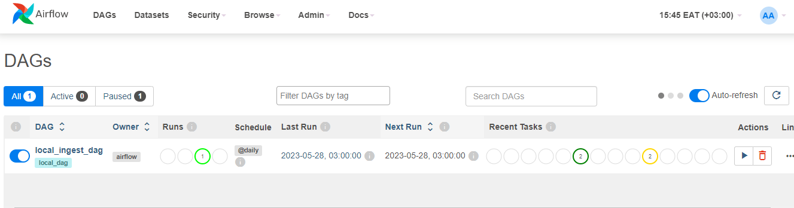
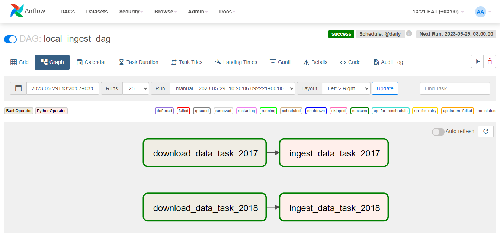

# Ingesting data to local postgresql using airflow and docker

This project is a continuation of the [Simple ETL Data Pipeline](https://github.com/katenjoki/simple_data_pipeline) where we built an ETL pipeline designed to run on Docker containers. The pipeline **extracts** Kenya's 2017 and 2018 Maize Production data by Counties from the [Kilimo Data Portal](http://kilimodata.org/dataset/kenya-maize-production-by-counties), **transforms** and **loads** the data into a PostgresQL database and uses pgAdmin to visualize, manage and interact with pgAdmin.

# Project Summary
In this project, I used Airflow as an orchestrator for data processing tasks. I defined and executed the workflows using Directed Acyclic Graphs (**DAGS**) to represent the sequence of tasks needed to process and load data into PostgreSQL.

I have also edited the [docker_compose.yaml](https://github.com/katenjoki/simple_data_pipeline/blob/master/docker-compose.yaml) file from the [Simple ETL Data Pipeline](https://github.com/katenjoki/simple_data_pipeline) project to simplify the code. This is why the edited folder is part of this project. 

Edits I've made in this project's [docker_compose.yaml file](https://github.com/katenjoki/postgresql_airflow/blob/master/simple_data_pipeline/docker-compose.yaml) for this demo:
* removed the 'maize_ke_ingest' service
* hashed out the pgadmin service configurations 
* added network 'airflow-default' so that airflow and postgreSQL can communicate.

# Prerequisites 
Docker: Make sure you have Docker installed on your machine. You can download and install Docker from the official website: https://www.docker.com

# Installation and Setup
1. Git clone the repo
```
git clone https://github.com/katenjoki/postgresql_airflow.git
```
2. Navigate to the airflow folder.
```
cd airflow
```
3. Open the .env file and review/update the following environment variables: <br>
* To set/change the value of the AIRFLOW_UID variable to your user's UID (User ID) run the following command. For Windows, use MINGW/GitBash and execute the same command. :
    ```
    echo -e "AIRFLOW_UID=$(id -u)" > .env
    ```

 * PostgreSQL credentials:
 
    `PG_HOST: This variable specifies the hostname of the PostgreSQL database server.`

    `PG_USER: This variable specifies the username to be used for authentication when connecting to the PostgreSQL server. `

    `PG_PASSWORD: This variable specifies the password for the specified PostgreSQL user. Please note that using root as the password is not recommended for production environments.`

    `PG_PORT: This variable specifies the port number on which the PostgreSQL server is listening for incoming connections. The default port for PostgreSQL is 5432.`

    `PG_DATABASE: This variable specifies the name of the PostgreSQL database to which you want to connect.`

4. Build the docker container
```
docker-compose build
```
5. Initialise airflow containers
```
docker-compose up airflow-init
```
6. Run the docker container
```
docker-compose up
```
7. Open a new command prompt as the airflow docker container is running in another window. 
8. Navigate to the [simple_data_pipeline](https://github.com/katenjoki/postgresql_airflow/tree/master/simple_data_pipeline) folder in your local machine.
9. Run the docker container
```
docker-compose up
```

# Running Airflow
Access the Airflow web interface (http://localhost:8080) and sign in with "airflow" as the username and the password. Please note that using these credentials is not recommended for production environments and only for demonstrative purposes.

Trigger the 'local_ingest_dag' and monitor the DAG runs.


When the workflow runs successfully, this is what you should see:


# Checking that the data was loaded in the PostgreSQL database
1. Open a new command prompt as the docker container is running in another window. 
2. 
