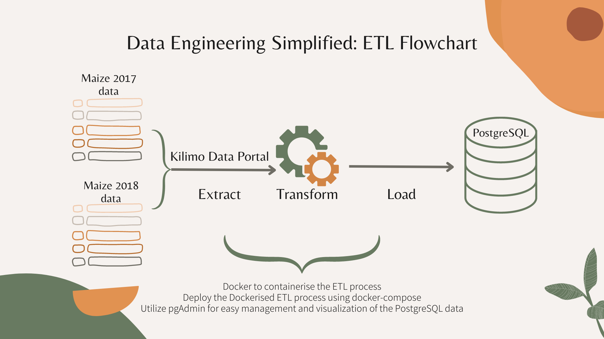
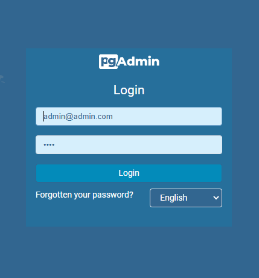
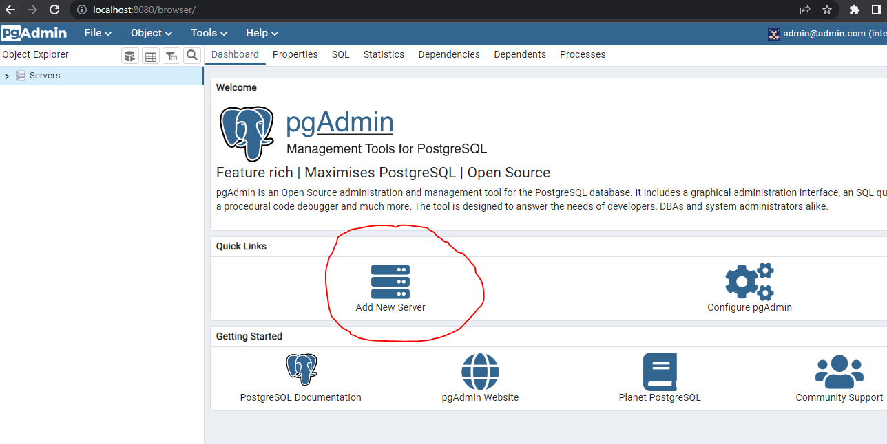
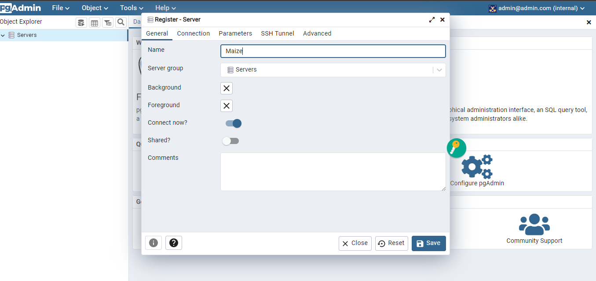
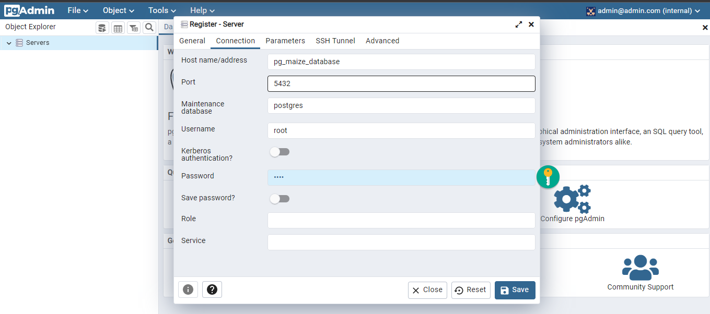
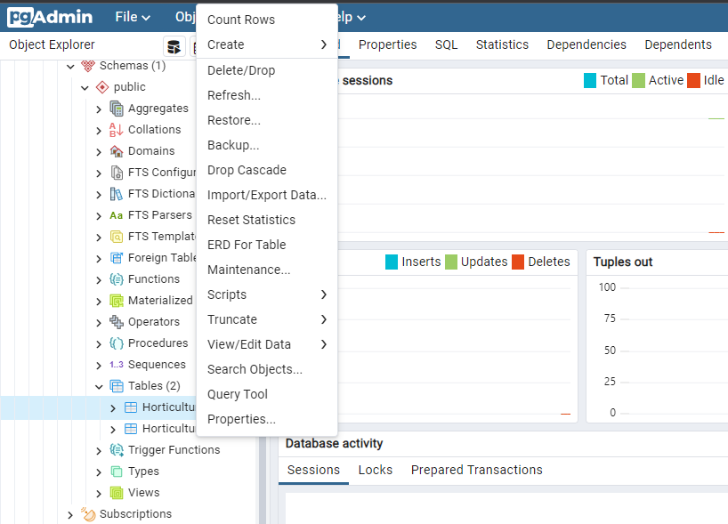

# Simple ETL data pipeline

This repository contains a simple data pipeline for **extracting**, **transforming** and **loading** Maize Production and Value by Counties for the years 2017 and 2018 from the [Kilimo Data Portal](http://kilimodata.org/dataset/kenya-maize-production-by-counties/resource/63fa57a5-a7c2-40e1-a728-f9546fa383ef) into a PostgreSQL database.

While it would have been ideal to work with more recent data, the availability of local public datasets can sometimes limit our options. However, despite the data being a few years old, I believe it is still relevant to this project.

# Table of contents
- [Table of Contents](#Table-Of-Contents)
- [ETL Flowchart](#etl-flowchart)
- [Project Structure](#project-structure)
- [Prerequisites](#prerequisites)
- [Installation and setup](#installation-and-setup)
- [PostgreSQL and pgAdmin Credentials](#PostgreSQL-and-pgAdmin-Credentials)
- [Disclaimer](#disclaimer)
- [Launching pgAdmin](#launching-pgAdmin)

# ETL Flowchart


This pipeline is designed to run within Docker containers, making it easy to set up and run the project, without having to install PostgreSQL and pgAdmin on your local machine.

# Project Structure
* 'Dockerfile': The Dockerfile that builds the Docker image for running the data pipeline.
* 'docker-compose.yaml': The Docker Compose configuration file that defines the services and their dependencies. It played a huge role in orchestrating the PostgreSQL container and the PgAdmin container. 
* 'ingest_agri_data.py': The python script used for extracting, transforming and loading the Maize data into the Postgresql database.

# Prerequisites
Docker: Make sure you have Docker installed on your machine. You can download and install Docker from the official website: https://www.docker.com

# Installation and setup
1. Clone the repository to your local machine <br>
```
git clone https://github.com/katenjoki/simple_data_pipeline.git
```
2. Navigate to the project directory
```
cd simple_data_pipeline
```
3. Build and run the Docker containers using Docker Compose
```
docker-compose build
```

```
docker-compose up
```

# PostgreSQL and pgAdmin Credentials
In order to connect to the PostgreSQL database, we use the pgAdmin PostgreSQL client tool.

Our PostgreSQL database credentials for this demo are as follows:
* user=root
* password=root
* host=pg_maize_database
* port=5432
* db=maize_KE

While our pgAdmin credentials are as follows:
* PGADMIN_DEFAULT_EMAIL=admin@admin.com
* PGADMIN_DEFAULT_PASSWORD=root

These credentials are added as environment variables to the [.env file](.env) and used by the docker-compose file.


# Launching pgAdmin

1. As the docker-container is running, open your browser and search:
```
localhost:8080
```
2. Login to pgAdmin with the pdAdmin default credentials mentioned [above](#PostgreSQL-and-pgAdmin-Credentials).

  
  
3. Click 'Add New Server'

  
  
4. Click on the 'General' tab and register the new server by giving it a name e.g. 'Maize'

  
  
5. Next, click on the 'Connection' tab and fill in the details using the [aforementioned PostgreSQL credentials](#PostgreSQL-and-pgAdmin-Credentials).

  
  
 6. Once you've registered the server, you should see 'Maize' server under 'Servers' in the 'Object Explorer' section at the top left part of the GUI.
      * Click on 'Databases' and you should see the 'maize_ke' database as one of your options.
      * Click on 'Schemas' 
      * Click on 'Tables' and you should see two tables, i.e. 'maize_2015' and 'maize_2016'. Right click on any of the tables to select the 'Query tool' and now you can start querying the data!
      
        

      * Confirm that the data was properly loaded to the database. Simple example query;
        ```
        SELECT * FROM "maize_2017" LIMIT(10)
        ```
        
# Partying shot
Feel free to contribute to this project by opening issues or submitting pull requests.

Happy coding!
